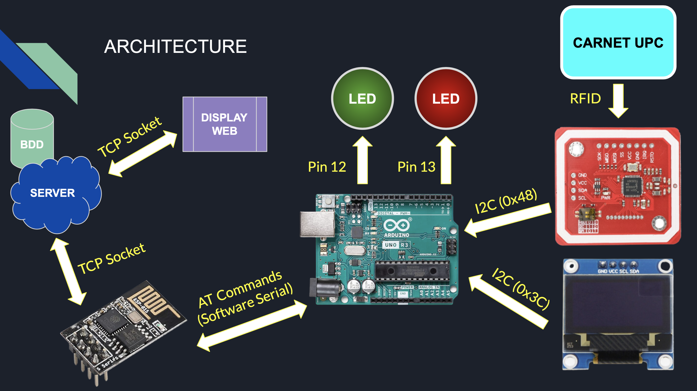
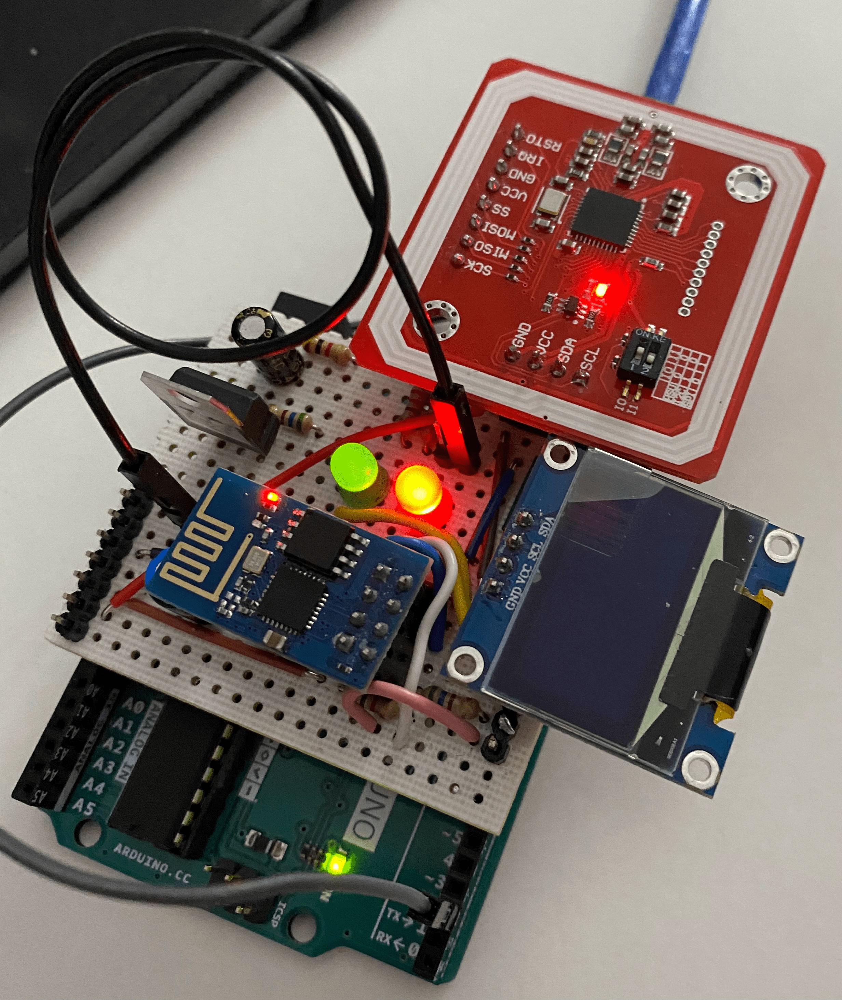
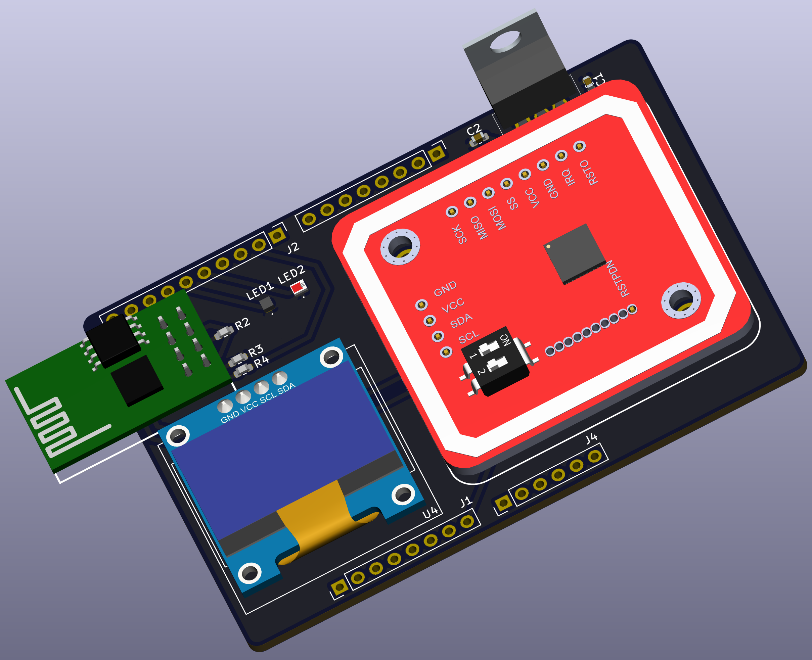
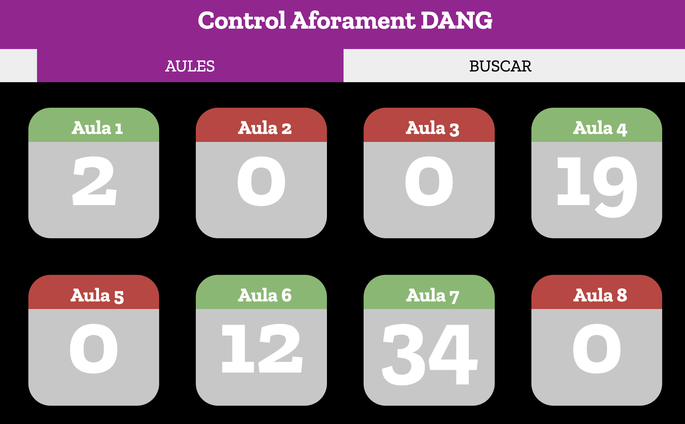

# DANG

## Overview
Debido al Covid, ha surgido una necesidad de controlar la cantidad de personas
que hay en los espacios, es decir, el aforamiento.

Debido a esta problemática surge DANG, un sistema de control de aforo en las
clases de mi universidad. Este sistema permite saber cuánta gente hay dentro de
una clase concreta y mantener una trazabilidad de las aulas en las que ha estado
cualquier persona.

## Architecture
El núcleo del proyecto es un Arduino UNO, el cual se comunica con diferentes
módulos.

* **PN532** --> Módulo que nos permite leer tarjetas RFID
* **SSD1306** --> Display Oled de 64x128 píxeles
* **ESP8206** --> Módulo que nos permite conectarnos a una red Wifi y realizar
  conexiones TCP

El proyecto también consta de una página web, la cual se comunica directamente
con el servidor para mostrar el aforo desde un ordenador o dispositivo móvil.

## Prototipe
Las primeras pruebas de software se realizaron sobre protoboard, y una vez se
tenía claro como funcionaba cada módulo y que configuración hardware requería,
se procedió a construir un prototipo.

## PCB
Tras comprobar que el prototipo funcionaba correctamente, se procedió a realizar
la PCB. La cual el esquemático replica completamente el circuito hecho en el
prototipo.

## Web Page
La web todavia se encuentra en fase de pruebas, pero su finalidad es poder ver
el aforo de cada aula en cada momento.

Hasta el momento su aspecto es el siguiente:

